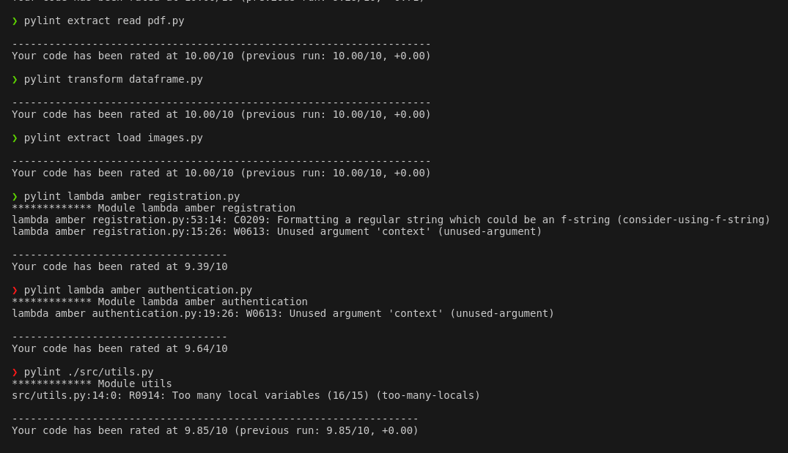
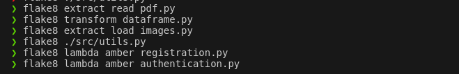

# API Amber-Rekognition

## Objetivo 

- Usar la información de la página de Alerta Amber en México y la tecnología de Amazon Rekognition para identificar fotos de menores de edad publicadas en  redes sociales que carecen de una Alerta Amber.

## Datos

- Los datos utilizados en este proyecto son scrapeados de [Alerta Amber México](https://alertaamber.fgr.org.mx/)
- Para las pruebas en test:
    - Para la prueba positiva, se buscó una paersona con Alerta Amber pero actualmente mayor de edad, y se descargaron dos fotos suyas de redes sociales.
    - Para las pruebas negaivas, se usaron nuestras fotos.

## Pasos

### Proceso de registro
- `extract_read_pdf.py`: Scrapea los pdf's de la página web de Alertas Amber
    + Como hay alertas con 3 y 4 dígitos, scrapea primero los de 3 dígitos y luego los de 4.
    + Descarga uno por uno los pdf y revisa si tienen contenido o si son números con un reporte vacío, si son números con un reporte vacío los borra.
    + Una vez que ha descargado todos los pdf's con información, los lee y coloca el texto de un pdf en una celda de un dataframe. 
    + Finalmente guarda el dataframe con los textos de los reportes en la carpeta de `data` con el nombre `pdf_data_raw.csv`.
- `transform_dataframe.py`: Acomoda los textos en columnas para que sea fácil accesar a la información de los reportes, filtra los reportes pertenecientes a Chiapas y los guarda como `chiapas.csv` en la carpeta de `data`, y  como `amber.json` en la carpeta de `facial-recognition-app/src`
- `extract_load_images.py`: Descarga las imágenes de los reportes de Chiapas y los sube a S3.
    + Primero lee el archivo en la carpeta de `data` llamado `chiapas.csv`
    + Luego con la información de éste archivo descarga las imágenes de menores desaparecidos con Alerta Amber en Chiapas
    + Finalmente sube estas imágenes a S3.
- `lamda_amber_registration.py`: Esta Lambda se activa cada que se suben imágenes al bucket `itam-proyecto-saraluz`, y obtiene una "huella digital" de la cara y le asigna un id, en este caso el número de reporte de Alerta Amber.
### Proceso de Identificación
- Colocar `npm start` en terminal estando dentro de la carpeta `facial-recognition-app`
- Se abrirá la aplicación `http://localhost:3000`
- Seleccionar una imagen para revisar de acuerdo con las instrucciones.
- Esta imágen se sube a S3 al bucket `itam-proyecto-saraluz-test` y la api en Gateway llama a la `lambda_amber_authentication.py`, la cual identifica o no a la persona, si logra identificar a la persona se desplegarán los datos de la alerta amber.

## Estructura del repositorio

`config`: Configuration files for data and aws services.
`data`: The inputs, preprocessing and outputs are stored here.
    `input`: Here is where the original `json` files are stored for further preprocessing.
    `preprocessing`: Intermediate tables such as catalogs are stored here.
    `output`: Cleaned data are stored here as parquet files.

## Arquitectura de la solución
 
La arquitectura de este proyecto se encuentra en el siguiente diagrama:

Diccionario de datos para `chiapas.csv`

- `id_file`: string. "A" ó "B" seguido de un guión bajo, seguido del número de reporte a 4 dígitos si es A y 3 si es B.  
- `image_file`: string. "image_" seguido del número de reporte.
- `reporte`: string. "AAMX" seguido del número de reporte.
- `fecha_act`: string. Fecha de activación.
- `nombre`: string. Nombre del menos de edad desaparecido.
- `fecha_nac`: string. Fecha de nacimiento.
- `edad`: string. Edad de desaparecido.
- `genero`: string. Masculino o Femenino.
- `fecha_hechos`: string. Fecha de los hechos.
- `lugar`: string. Estado
- `nacionalidad`: string. Nacionalidad
- `tipo_cabello`: string. Tipo de Cabello.
- `color_cabello`: string. Color del cabello.
- `color_ojos`: string. Color de ojos.
- `estatura`: string. Estatura.
- `peso`: string. Peso.
- `senas_part`: string. Señas particulares del desaparecido.
- `acompanante`: string. Acompañante.
- `acompanante_sp`: string. Señas particulares del acompañante.
- `sospechoso`: string. Nombre del sospechoso.
- `sospechoso_sp`: string. Señas particulares del sospechoso.
- `resumen_hechos`: string. Resumen de los hechos.

## Tecnologías usadas

- `Amazon Rekognition`: Se utilizó para crear la huella digital de los rostros de los desaparecidos.

- `Amazon S3`: Se usa para almacenar las imágenes de las Alertas Amber en Chiapas y de las imágenes para revisión.

- `Amazon DynamoDB`: Se usa para almacenar la huella digital y id de las imágenes.

- `Amazon Gateway`: Crea la api que conecta la lambda de identificación.

- `Amazon Lambda`: se usa para registrar a las imágenes de los desaparecidos, y para comparar las imágenes que se desea revisar.

- `Python`: se utiliza para scrapear y obtener la información de la página de Alertas Amber.

## Escenario de Producción

- Assuming that Yelp data can be extracted periodically, this pipeline can be executed in AWS services using a EMR cluster with Spark.

- Data should be stored in the data lake in S3, using the code `S00_stage_data.ipynb`.

- The ETL in `S01_etl.ipynb` already has the code to launch the EMR cluster, and in `config` the configuration files to setup the credentials and variables for the infrastructure will be stored.

- Based on the objective of this analysis, the pipeline could be scheduled to run with Airflow every start of a new month.

## Pylint y Flake8

## Working backwards
https://docs.google.com/document/d/1iUAD5lQKMfh_aG3wlN3bzLpjRmP-iITJtGmMrn_kBBs/edit?usp=sharing

## Presentación
https://docs.google.com/presentation/d/1sboQzMv_p1cDkurnLl7EnGX2L56W2bM19JhrGj4lsiE/edit?usp=sharing

#